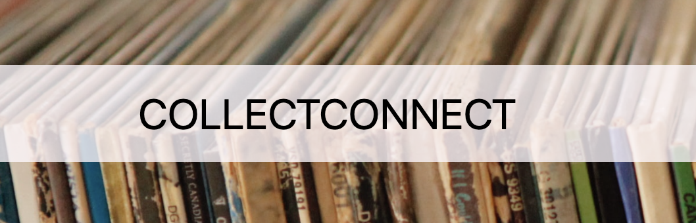

# COLLECTCONNECT

## Description
an application dedicated to collectors, COLLECTCONNECT provides collectors with a platform to curate and display their collections as well as explore collections of other users.

[🚀 Repo on Github](https://github.com/DanielTBonn/collectors-connect)

[🚀Deployed Site](https://boiling-anchorage-11027-d19406c04dfb.herokuapp.com/)

## Table of Contents
- [How to Get Started](#how-to-get-started)
- [User Story](#user-story)
- [Acceptance Criteria](#acceptance-criteria)
- [Preview](#preview)
- [Future Development](#future-development)
- [License](#license)

## How to Get Started
1. Sign Up and Log In: Create your collector profile and start curating your collections.

2. Explore: Check out collections from other users and begin creating your own collections.

3. Stay Tuned: We have many exciting plans for future development, making CollectConnect the go-to platform for collectors to connect. Che

## USER STORY

As a collector of special objects, I want to be able to store my collection(s) and see what other collectors are collecting, so that I can connect with a larger community of collectors.

## ACCEPTANCE CRITERIA

When I view the main page and I am not logged in,

Then the home page instructs me to log-in.

When I am on the login page,

Then I have the option to enter in my email and password to login or go to a sign up page,

When I am on the sign up page, 

Then I have the option to enter in an email, username, and password to sign up for the application,

When I view the main page and I am logged in, 

Then I am presented with a display of different collections,

When I view the header with a navbar,

Then I am presented with a our website name, a search button, a home-page button a login or logout button, and a profile button,

When I click on a collection from the home page,

Then I can view that collection and the items in that collection,

When I am logged in,

Then a profile icon that links to my user page shows up on the navbar as well as a logout icon,

When I navigate to my profile page,

Then all of my collections display and/or there is a button to 'add new collection'.

When i click 'add new collection',

Then I am able to add a collection with a name and a description or I can edit one of my existing collections,

When I wish to edit or delete my existing collection,

Then I can click delete to delete or edit to change the name and/or the description,

When I view a collection that is not mine, 

Then the editing buttons are not available to me, 

When I wish to search for a collection,

Then I can use a search bar or click a button to discover a random collection,

When I click the log out option,

Then I am redirected to the home page. 

## Preview

## Future Development
Now that the essential structure of the site is in place, we look forward to implementing additional features…

- Tag Feature

- Commenting Feature

- Gallery Display/Edit Feature

- User-to-User Messaging Feature

- Trade Feature

- Collection Management Feature

## License
  
[License](./LICENSE)
This application is covered under the [MIT License](./LICENSE) license.